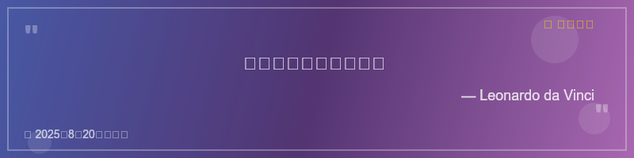

# Hi 👋, I'm He Lei

### 🌱 About Me
- 🔭 I’m currently working on **Frontend / Fullstack projects**
- 🌱 I’m learning **React, Vue, Node.js**
- 👯 I’m looking to collaborate on **Open Source projects**
- 💬 Ask me about **JS, CSS, Web Animations**
- 📫 How to reach me: [Email](mailto:your_email@example.com)
- ⚡ Fun fact: Coffee fuels my coding ☕ 

---

### 💻 Tech Stack

---

### 📖 Daily Quote
> Loading a random quote... <!-- GitHub Actions 会每天自动更新这里 -->

---

### 📊 GitHub Stats

## 📖 每日一句 Daily Quote

